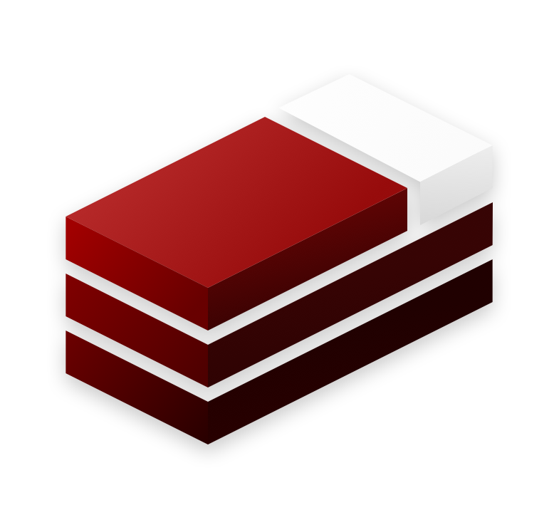

<div align='center'>


<h1>Bedstack (Stripped)</h1>

[](https://github.com/bedtime-coders/bedstac/actions/workflows/tests.yml?query=branch%3Amain+event%3Apush) [](https://discord.gg/8UcP9QB5AV) [](https://github.com/bedtime-coders/bedstack-stripped/blob/main/LICENSE) [](https://bun.sh/) [](https://elysiajs.com/) [](https://drizzle.team/) [](https://biomejs.dev/) [](https://scalar.com/) [](https://github.com/bedtime-coders/bedstack-stripped/stargazers/)

⚡ Stripped version of [Bedstack](https://github.com/bedtime-coders/bedstack) for rapid prototyping

</div>

## Bedstack: Bun + ElysiaJS + Drizzle Stack

**Bedstack** is a collection of bleeding-edge technologies to build modern web applications.

Including:

- **B**: [Bun](https://bun.sh) - Runtime + package manager, [Biome](https://biomejs.dev) - Code quality
- **E**: [ElysiaJS](https://elysiajs.com) - HTTP Framework
- **D**: [Drizzle](https://orm.drizzle.team) - ORM

## How is this different from Bedstack?

This is a stripped version of [Bedstack](https://github.com/bedtime-coders/bedstack) for rapid prototyping, with the same core design, but simplified. See our [ARCHITECTURE.md](./ARCHITECTURE.md) for more details!

## Development

1. Install dependencies

   ```bash
   bun install
   ```

2. Copy `.env.example` to `.env` and fill in the values

   ```bash
   cp .env.example .env
   ```

3. Start the database server

   ```bash
   bun db:start
   ```

4. Push the database schema to the database

   ```bash
   bun db:push
   ```

5. Start the development server

   ```bash
   bun dev
   ```

6. (Optional) Start the [database studio](https://orm.drizzle.team/drizzle-studio/overview)
   ```bash
   bun db:studio
   ```


## Testing

Run all tests:
```bash
bun run test # Not `bun test`!
```

Or run different test suites individually:
```bash
bun test:api # Run the API tests
bun test:unit # Run the unit tests
```

> [!TIP]
> To create test-specific environment configuration, create a `.env.test` file. You may use `.env.test.example` as a template:
> ```bash
> cp .env.test.example .env.test
> ```

## Contributing

See [CONTRIBUTING.md](./CONTRIBUTING.md) for more information, including how to set up your development environment.
